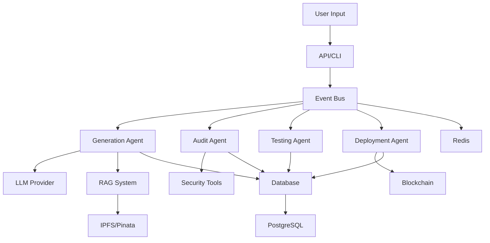
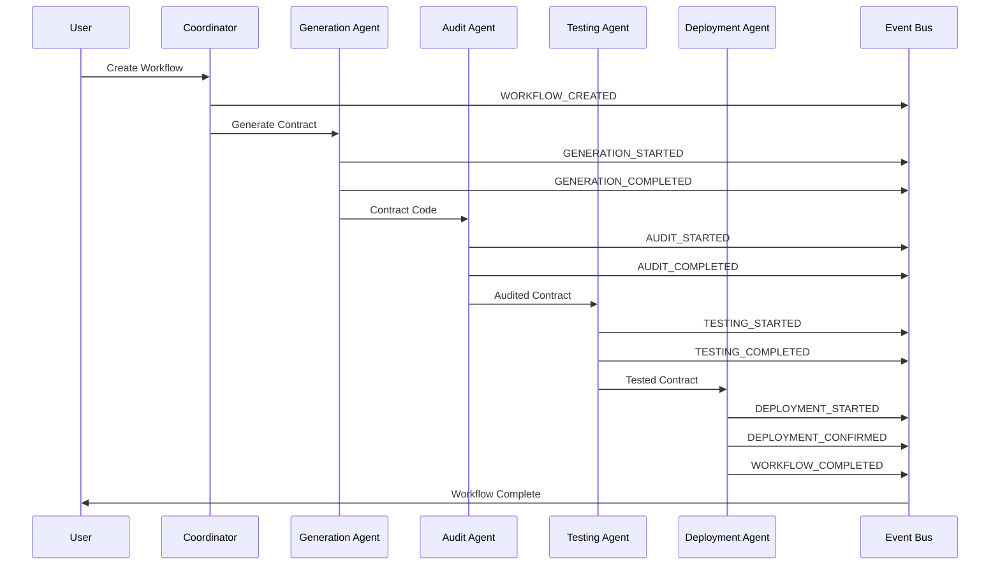

# HyperAgent Architecture Diagrams

**Generated**: 2025-01-27  
**Purpose**: Visual documentation of HyperAgent system architecture

---

## Table of Contents

1. [System Architecture Overview](#system-architecture-overview)
2. [Agent Interaction Flow](#agent-interaction-flow)
3. [Data Flow Diagram](#data-flow-diagram)
4. [Deployment Architecture](#deployment-architecture)
5. [Event Flow Diagram](#event-flow-diagram)

---

## System Architecture Overview

### High-Level Architecture

```
┌─────────────────────────────────────────────────────────────────────────┐
│                         HyperAgent Platform                             │
├─────────────────────────────────────────────────────────────────────────┤
│                                                                           │
│  ┌──────────────┐      ┌──────────────┐      ┌──────────────┐          │
│  │  CLI Layer   │      │  API Layer   │      │   Web UI    │          │
│  │  (Click)     │      │  (FastAPI)   │      │  (Future)   │          │
│  └──────┬───────┘      └──────┬───────┘      └──────┬───────┘          │
│         │                     │                      │                   │
│         └─────────────────────┼──────────────────────┘                   │
│                               │                                          │
│                    ┌──────────▼──────────┐                              │
│                    │  Event Bus (Redis)  │                              │
│                    │  - Message Queue    │                              │
│                    │  - Cache Layer      │                              │
│                    │  - Streams          │                              │
│                    └──────────┬──────────┘                              │
│                               │                                          │
│         ┌─────────────────────┼─────────────────────┐                  │
│         │                     │                     │                  │
│    ┌────▼────┐          ┌────▼────┐          ┌────▼────┐             │
│    │ Agent 1 │          │ Agent 2 │          │ Agent 3 │             │
│    │Generate │          │ Audit   │          │ Deploy  │             │
│    └────┬────┘          └────┬────┘          └────┬────┘             │
│         │                    │                    │                     │
│    ┌────▼──────────────────────────────────────────▼───┐              │
│    │      Blockchain Interaction Layer                 │              │
│    │  - Hyperion Testnet & Mainnet (Chain ID: 133717) │              │
│    │  - Mantle Testnet (5003) & Mainnet (5000)        │              │
│    │  - EigenDA Integration (Data Availability)         │              │
│    │  - Alith SDK (Smart Contract)                      │              │
│    └────┬──────────────────────────────────────────────┘              │
│         │                                                               │
│    ┌────▼──────────────────────────────────────────────┐              │
│    │     Data Persistence Layer (Supabase)            │              │
│    │  - PostgreSQL (Primary Store)                     │              │
│    │  - pgvector (Semantic Search)                    │              │
│    │  - Redis (Cache & State)                         │              │
│    │  - IPFS/Pinata (Templates & RAG)                  │              │
│    └─────────────────────────────────────────────────┘              │
│                                                                           │
│  ┌────────────────┐  ┌────────────────┐  ┌────────────────┐          │
│  │Security Layer   │  │Monitoring      │  │Audit Log       │          │
│  │- Mythril       │  │- Prometheus    │  │- All Actions   │          │
│  │- Slither       │  │- Grafana       │  │- Immutable     │          │
│  │- Echidna       │  │- Structured    │  │- Timestamped   │          │
│  └────────────────┘  │  Logging       │  └────────────────┘          │
│                       └────────────────┘                               │
│                                                                           │
└─────────────────────────────────────────────────────────────────────────┘
```

### Component Descriptions

- **CLI Layer**: Command-line interface using Click framework
- **API Layer**: FastAPI REST API with WebSocket support
- **Event Bus**: Redis Streams for event-driven communication
- **Agents**: Specialized agents for generation, audit, testing, deployment
- **Blockchain Layer**: Web3 integration for Hyperion and Mantle networks
- **Data Layer**: PostgreSQL with pgvector, Redis cache, IPFS storage
- **Security Layer**: Automated security auditing tools
- **Monitoring**: Prometheus metrics and Grafana dashboards

---

## Agent Interaction Flow

### Workflow Execution Flow

```
User Input (NLP)
  │
  ├─→ [*] API/CLI Parser
  │
  ├─→ [*] Workflow Coordinator
  │    │
  │    ├─→ [*] Generation Agent
  │    │    ├─ LLM Call (Gemini/OpenAI)
  │    │    ├─ RAG Template Retrieval
  │    │    ├─ Contract Code Generation
  │    │    └─ Store in Database
  │    │
  │    ├─→ [*] Audit Agent
  │    │    ├─ Slither Analysis
  │    │    ├─ Mythril Analysis
  │    │    ├─ Echidna Fuzzing
  │    │    └─ Risk Score Calculation
  │    │
  │    ├─→ [*] Testing Agent
  │    │    ├─ Compile Contract
  │    │    ├─ Run Unit Tests
  │    │    └─ Generate Test Report
  │    │
  │    └─→ [*] Deployment Agent
  │         ├─ Build Transaction
  │         ├─ Sign Transaction
  │         ├─ Submit to Blockchain
  │         ├─ Wait for Confirmation
  │         └─ Store Deployment Info
  │
  └─→ [*] Event Bus (Redis Streams)
       ├─ Workflow Events
       ├─ Agent Events
       └─ System Events
```

### Agent-to-Agent Communication (A2A)

```
┌─────────────┐         ┌─────────────┐         ┌─────────────┐
│  Generation  │────────▶│    Audit    │────────▶│  Deployment │
│    Agent     │  A2A    │    Agent    │  A2A    │    Agent    │
└─────────────┘         └─────────────┘         └─────────────┘
      │                        │                        │
      │                        │                        │
      └────────────────────────┼────────────────────────┘
                               │
                    ┌──────────▼──────────┐
                    │   Event Bus (Redis)  │
                    │   - Message Queue    │
                    │   - Correlation IDs  │
                    │   - Retry Logic      │
                    └──────────────────────┘
```

---

## Data Flow Diagram

### Contract Generation to Deployment Flow

```
┌──────────────┐
│  User Input  │
│  (NLP Text)  │
└──────┬───────┘
       │
       ▼
┌──────────────────┐
│  RAG System      │
│  - Vector Search │
│  - Template      │
│    Retrieval     │
└──────┬───────────┘
       │
       ▼
┌──────────────────┐
│  LLM Provider    │
│  - Gemini/OpenAI │
│  - Code Gen      │
└──────┬───────────┘
       │
       ▼
┌──────────────────┐
│  Generated        │
│  Contract Code    │
└──────┬───────────┘
       │
       ├─────────────────┐
       │                 │
       ▼                 ▼
┌──────────────┐  ┌──────────────┐
│  Database    │  │  IPFS/Pinata │
│  (PostgreSQL)│  │  (Storage)   │
└──────┬───────┘  └──────────────┘
       │
       ▼
┌──────────────────┐
│  Security Audit  │
│  - Slither       │
│  - Mythril       │
│  - Echidna       │
└──────┬───────────┘
       │
       ▼
┌──────────────────┐
│  Testing         │
│  - Compilation   │
│  - Unit Tests    │
└──────┬───────────┘
       │
       ▼
┌──────────────────┐
│  Deployment      │
│  - Build TX      │
│  - Sign TX       │
│  - Submit        │
└──────┬───────────┘
       │
       ▼
┌──────────────────┐
│  Blockchain      │
│  (Hyperion/Mantle)│
└──────────────────┘
```

### Database Schema Relationships

```
┌──────────┐
│   User   │
└────┬─────┘
     │ 1
     │
     │ N
┌────▼─────────┐
│  Workflow    │
└────┬─────────┘
     │ 1
     │
     │ N
┌────▼──────────────┐
│ GeneratedContract │
└────┬──────────────┘
     │ 1
     │
     ├─── N ───┐
     │         │
     ▼         ▼
┌─────────┐ ┌──────────┐
│ Security│ │Deployment│
│  Audit  │ │          │
└─────────┘ └──────────┘
```

---

## Deployment Architecture

### Production Deployment

```
┌─────────────────────────────────────────────────────────────┐
│                    Production Environment                     │
├─────────────────────────────────────────────────────────────┤
│                                                               │
│  ┌──────────────┐      ┌──────────────┐      ┌──────────┐ │
│  │   Load       │      │   HyperAgent │      │  Database │ │
│  │   Balancer   │─────▶│   API        │─────▶│ (Supabase)│ │
│  │   (Nginx)    │      │   (FastAPI)  │      │           │ │
│  └──────────────┘      └──────┬───────┘      └───────────┘ │
│                                │                            │
│                       ┌────────▼────────┐                   │
│                       │  Redis Cache   │                   │
│                       │  & Event Bus   │                   │
│                       └────────────────┘                   │
│                                                               │
│  ┌──────────────┐      ┌──────────────┐      ┌──────────┐ │
│  │  Prometheus  │      │   Grafana    │      │  Alert   │ │
│  │  (Metrics)   │◀─────│  (Dashboards)│─────▶│ Manager  │ │
│  └──────────────┘      └──────────────┘      └──────────┘ │
│                                                               │
│  ┌──────────────┐      ┌──────────────┐                     │
│  │  Blockchain  │      │  IPFS/Pinata │                     │
│  │  Networks    │      │  (Storage)   │                     │
│  └──────────────┘      └──────────────┘                     │
│                                                               │
└─────────────────────────────────────────────────────────────┘
```

### Docker Container Architecture

```
┌─────────────────────────────────────────────────────────────┐
│                    Docker Compose Stack                       │
├─────────────────────────────────────────────────────────────┤
│                                                               │
│  ┌─────────────────────────────────────────────────────┐   │
│  │  hyperagent (Main Application)                      │   │
│  │  - FastAPI Server                                   │   │
│  │  - Workers: 4                                       │   │
│  │  - Port: 8000                                       │   │
│  └─────────────────────────────────────────────────────┘   │
│                                                               │
│  ┌─────────────────────────────────────────────────────┐   │
│  │  postgres (Database)                                │   │
│  │  - PostgreSQL 15                                    │   │
│  │  - pgvector Extension                               │   │
│  │  - Port: 5432                                       │   │
│  └─────────────────────────────────────────────────────┘   │
│                                                               │
│  ┌─────────────────────────────────────────────────────┐   │
│  │  redis (Cache & Event Bus)                          │   │
│  │  - Redis 7                                          │   │
│  │  - Streams Enabled                                  │   │
│  │  - Port: 6379                                       │   │
│  └─────────────────────────────────────────────────────┘   │
│                                                               │
└─────────────────────────────────────────────────────────────┘
```

---

## Event Flow Diagram

### Event-Driven Architecture

```
┌──────────────┐
│  Workflow    │
│  Created     │
└──────┬───────┘
       │
       ▼
┌──────────────────┐
│  Event Bus       │
│  (Redis Streams) │
└──────┬───────────┘
       │
       ├──────────────┬──────────────┬──────────────┐
       │              │              │              │
       ▼              ▼              ▼              ▼
┌──────────┐  ┌──────────┐  ┌──────────┐  ┌──────────┐
│ Generation│  │   Audit  │  │  Testing │  │Deployment│
│  Agent    │  │  Agent   │  │  Agent   │  │  Agent   │
└─────┬─────┘  └─────┬────┘  └─────┬────┘  └─────┬────┘
      │              │              │              │
      └──────────────┼──────────────┼──────────────┘
                     │              │
                     ▼              ▼
            ┌────────────────┐  ┌────────────────┐
            │  Event Handlers │  │  WebSocket     │
            │  (Processing)   │  │  (Real-time)   │
            └────────────────┘  └────────────────┘
                     │
                     ▼
            ┌────────────────┐
            │  Database      │
            │  (Persistence)  │
            └────────────────┘
```

### Event Types Flow

```
WORKFLOW_CREATED
    │
    ├─→ WORKFLOW_STARTED
    │
    ├─→ GENERATION_STARTED
    │   ├─→ GENERATION_COMPLETED
    │   └─→ GENERATION_FAILED (if error)
    │
    ├─→ AUDIT_STARTED
    │   ├─→ AUDIT_COMPLETED
    │   └─→ AUDIT_FAILED (if error)
    │
    ├─→ TESTING_STARTED
    │   ├─→ TESTING_COMPLETED
    │   └─→ TESTING_FAILED (if error)
    │
    ├─→ DEPLOYMENT_STARTED
    │   ├─→ DEPLOYMENT_PENDING_CONFIRMATION
    │   ├─→ DEPLOYMENT_CONFIRMED
    │   └─→ DEPLOYMENT_FAILED (if error)
    │
    └─→ WORKFLOW_COMPLETED
        └─→ WORKFLOW_FAILED (if any stage fails)
```

---

## Mermaid Diagrams

### System Architecture (Mermaid)



### Agent Workflow (Mermaid)



---

## Notes

- All diagrams use ASCII art for version control compatibility
- Mermaid diagrams are provided as alternative visualization
- Diagrams reflect actual implementation architecture
- Component relationships match database schema
- Event flows match event types defined in code

---

## References

- Technical Specification: `docs/complete-tech-spec.md`
- Implementation Status: `docs/IMPLEMENTATION_STATUS.md`
- Event Types: `hyperagent/events/event_types.py`
- Database Models: `hyperagent/models/`

