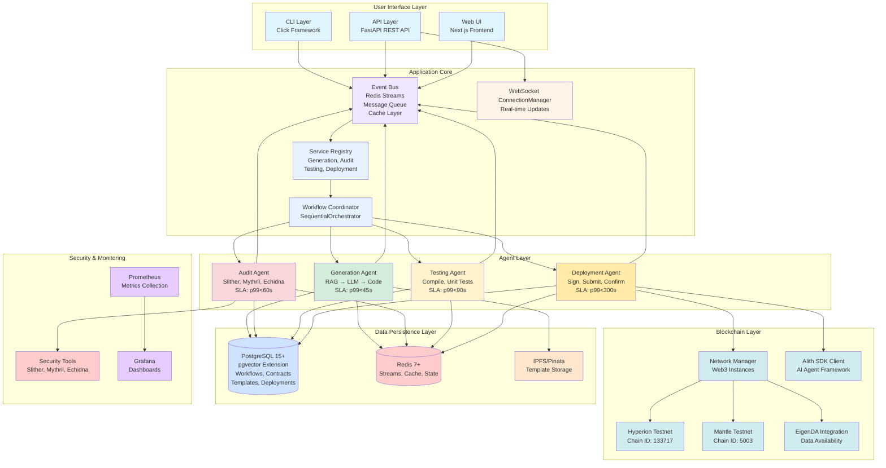

# HyperAgent System Architecture Overview

## Diagram

## Technology Stack

- **Backend**: Python 3.10+, FastAPI, SQLAlchemy, Alembic
- **Database**: PostgreSQL 15+ with pgvector extension
- **Cache/Events**: Redis 7+ with Streams
- **Blockchain**: Web3.py, Alith SDK, EigenDA
- **LLM**: Google Gemini, OpenAI GPT-4
- **Security**: Slither, Mythril, Echidna
- **Frontend**: Next.js, React, TypeScript
- **Monitoring**: Prometheus, Grafana

## Architecture Principles

- **Service-Oriented Architecture (SOA)**: Decoupled services with clear interfaces
- **Agent-to-Agent (A2A) Protocol**: Decoupled agent communication via event bus
- **Event-Driven Architecture**: Redis Streams for event persistence and real-time updates
- **Service Orchestration**: Sequential and parallel service execution patterns
- **RAG System**: Template retrieval and similarity matching for enhanced generation

