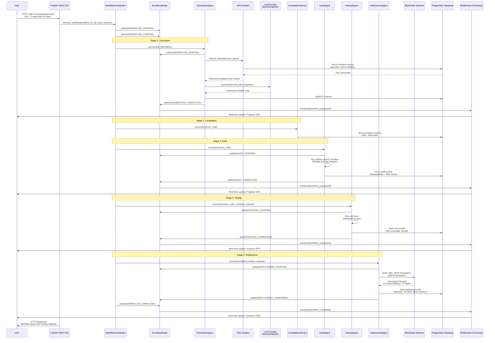

# Complete Workflow Sequence Diagram

## Diagram

## Workflow Stages

1. **Generation** (20% progress)
   - RAG template retrieval
   - LLM code generation
   - Constructor argument extraction
   - SLA: p99 < 45s

2. **Compilation** (40% progress)
   - Solidity compilation
   - ABI extraction
   - Bytecode generation

3. **Audit** (60% progress)
   - Slither static analysis
   - Mythril symbolic execution
   - Echidna fuzzing
   - Risk score calculation
   - SLA: p99 < 60s

4. **Testing** (80% progress)
   - Contract compilation
   - Unit test execution
   - Test coverage analysis
   - SLA: p99 < 90s

5. **Deployment** (100% progress)
   - Transaction building
   - Transaction signing
   - Blockchain submission
   - Confirmation waiting
   - SLA: p99 < 300s

## Event Types

- `WORKFLOW_CREATED` - Workflow initialized
- `WORKFLOW_STARTED` - Workflow execution begins
- `GENERATION_STARTED/COMPLETED` - Generation stage events
- `AUDIT_STARTED/COMPLETED` - Audit stage events
- `TESTING_STARTED/COMPLETED` - Testing stage events
- `DEPLOYMENT_STARTED/CONFIRMED` - Deployment stage events
- `WORKFLOW_COMPLETED` - Workflow finished successfully

