# Agent-to-Agent (A2A) Communication Protocol

## Diagram

```mermaid
graph TB
    subgraph "Event Bus - Redis Streams"
        EB[EventBus<br/>Redis Streams<br/>Central Hub]
        S1[Stream: events:workflow.*]
        S2[Stream: events:generation.*]
        S3[Stream: events:audit.*]
        S4[Stream: events:deployment.*]
        S5[Stream: events:a2a.*]
        
        EB --> S1
        EB --> S2
        EB --> S3
        EB --> S4
        EB --> S5
    end

    subgraph "Event Producers"
        CA[CoordinatorAgent<br/>WORKFLOW_CREATED<br/>WORKFLOW_STARTED<br/>WORKFLOW_COMPLETED]
        GA[GenerationAgent<br/>GENERATION_STARTED<br/>GENERATION_COMPLETED]
        AA[AuditAgent<br/>AUDIT_STARTED<br/>AUDIT_COMPLETED]
        TA[TestingAgent<br/>TESTING_STARTED<br/>TESTING_COMPLETED]
        DA[DeploymentAgent<br/>DEPLOYMENT_STARTED<br/>DEPLOYMENT_CONFIRMED]
    end

    subgraph "Event Consumers"
        WS[WebSocket Manager<br/>Filters by workflow_id<br/>Broadcasts to clients]
        DB[Database Writer<br/>Writes workflow state<br/>Persists results]
        MET[Metrics Collector<br/>Aggregates metrics<br/>Sends to Prometheus]
        LOG[Log Aggregator<br/>Structured logging]
    end

    CA -->|XADD| EB
    GA -->|XADD| EB
    AA -->|XADD| EB
    TA -->|XADD| EB
    DA -->|XADD| EB

    EB -->|XREADGROUP| WS
    EB -->|XREADGROUP| DB
    EB -->|XREADGROUP| MET
    EB -->|XREADGROUP| LOG

    subgraph "A2A Message Flow Example"
        GA2[GenerationAgent] -->|A2A_REQUEST<br/>correlation_id: abc123<br/>payload: contract_code| EB2[EventBus]
        EB2 -->|Event: generation.completed<br/>Filter by workflow_id| AA2[AuditAgent]
        AA2 -->|A2A_RESPONSE<br/>correlation_id: abc123<br/>payload: audit_results| EB2
        EB2 -->|Response received| GA2
    end

    subgraph "Event Structure"
        EVENT[Event<br/>id: UUID<br/>type: EventType<br/>workflow_id: string<br/>timestamp: datetime<br/>data: Dict<br/>source_agent: string]
    end

    subgraph "A2A Message Structure"
        MSG[A2AMessage<br/>sender_agent: string<br/>receiver_agent: string<br/>message_type: request/response<br/>correlation_id: string<br/>payload: Dict<br/>timeout_ms: int<br/>retry_count: int]
    end

    subgraph "Retry Logic"
        R1[Request sent] -->|Wait 5s| R2{Response<br/>received?}
        R2 -->|Yes| R3[Process response]
        R2 -->|No| R4{retry_count<br/>< 3?}
        R4 -->|Yes| R5[Exponential backoff<br/>2^retry_count s]
        R5 --> R1
        R4 -->|No| R6[Raise TimeoutError]
    end

    style EB fill:#f0e6ff
    style CA fill:#e6f3ff
    style GA fill:#d4edda
    style AA fill:#f8d7da
    style TA fill:#fff3cd
    style DA fill:#ffeaa7
    style WS fill:#d1ecf1
    style DB fill:#cfe2ff
    style MET fill:#e6ccff
    style LOG fill:#ffe6cc
```



## A2A Protocol Features

### Message Types
- **A2A_REQUEST**: Request message from one agent to another
- **A2A_RESPONSE**: Response message back to requesting agent
- **Event**: Broadcast event to all subscribers

### Correlation Tracking
- Each request has a unique `correlation_id`
- Responses include the same `correlation_id`
- Enables request/response matching

### Retry Logic
- Timeout: 5 seconds (configurable)
- Max retries: 3 attempts
- Exponential backoff: 2^retry_count seconds
- Dead letter queue for failed messages

### Consumer Groups
- `websocket_workers` - WebSocket connections
- `db_writers` - Database persistence
- `metrics_collectors` - Metrics aggregation
- `log_aggregators` - Log collection

### Redis Streams Operations

**Publish (XADD)**:
```redis
XADD events:workflow.started * 
  data '{"id":"...","type":"workflow.started",...}'
```

**Consume (XREADGROUP)**:
```redis
XREADGROUP GROUP websocket_workers worker-1
  STREAMS events:workflow.* >
  COUNT 10
  BLOCK 1000
```

**Acknowledge (XACK)**:
```redis
XACK events:workflow.started 
  websocket_workers event_id
```

## Benefits

- **Decoupling**: Agents don't need direct references
- **Scalability**: Multiple consumers can process events
- **Reliability**: Redis Streams provides persistence
- **Real-time**: Events propagate immediately
- **Load Balancing**: Consumer groups distribute work

