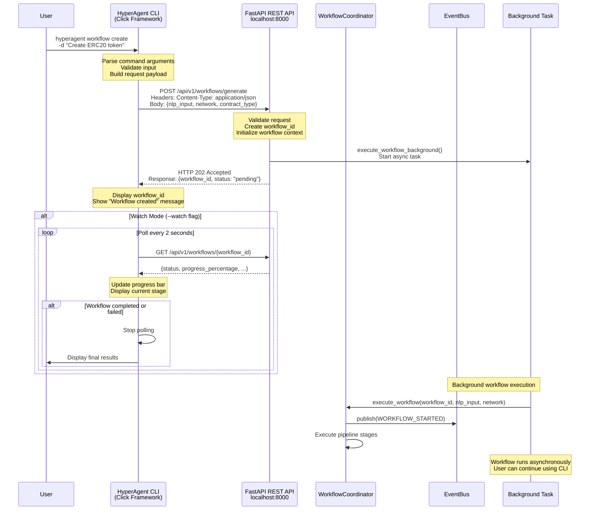

# Under the Hood: How the CLI Talks to HyperAgent

## Overview

When you type `hyperagent workflow create`, the CLI acts as an intelligent assistant that communicates with the HyperAgent API to orchestrate smart contract generation.

## Diagram



## CLI Command Flow

### 1. Command Parsing
```python
# CLI receives command
@click.command()
@click.option('-d', '--description', required=True)
@click.option('--network', default='hyperion_testnet')
def workflow_create(description, network):
    # Parse and validate
    # Build API request
```

### 2. API Request
```python
# CLI makes HTTP request
async with httpx.AsyncClient() as client:
    response = await client.post(
        f"{api_url}/api/v1/workflows/generate",
        json={
            "nlp_input": description,
            "network": network,
            "contract_type": "ERC20"
        }
    )
```

### 3. API Response
```json
{
    "workflow_id": "550e8400-e29b-41d4-a716-446655440000",
    "status": "pending",
    "message": "Workflow created successfully"
}
```

### 4. Progress Monitoring (if --watch)
```python
# Poll API for updates
while True:
    status = await get_workflow_status(workflow_id)
    display_progress_bar(status.progress_percentage)
    
    if status in ["completed", "failed"]:
        break
    
    await asyncio.sleep(2)  # Poll every 2 seconds
```

## CLI Features

### Real-time Progress Display
- Unicode progress bar (Windows-safe fallback)
- Stage indicators (Generating, Auditing, Testing, Deploying)
- Percentage completion
- Elapsed time tracking

### Output Formats
- **Table** (default): Formatted table with status
- **JSON**: Raw JSON output
- **YAML**: YAML formatted output
- **Compact**: Single line summary

### Error Handling
- Connection errors: Check if API is running
- HTTP errors: Display user-friendly messages
- Timeout handling: Graceful timeout with retry suggestions

## API Endpoints Used

- `POST /api/v1/workflows/generate` - Create workflow
- `GET /api/v1/workflows/{id}` - Get workflow status
- `GET /api/v1/health/` - Check API health
- `GET /api/v1/contracts/{id}` - Get contract details
- `GET /api/v1/deployments/{id}` - Get deployment details

## Benefits

- **Non-blocking**: Workflow runs in background
- **Real-time Updates**: Progress monitoring with --watch
- **User-friendly**: Clear error messages and suggestions
- **Flexible**: Multiple output formats
- **Cross-platform**: Windows-safe Unicode handling

