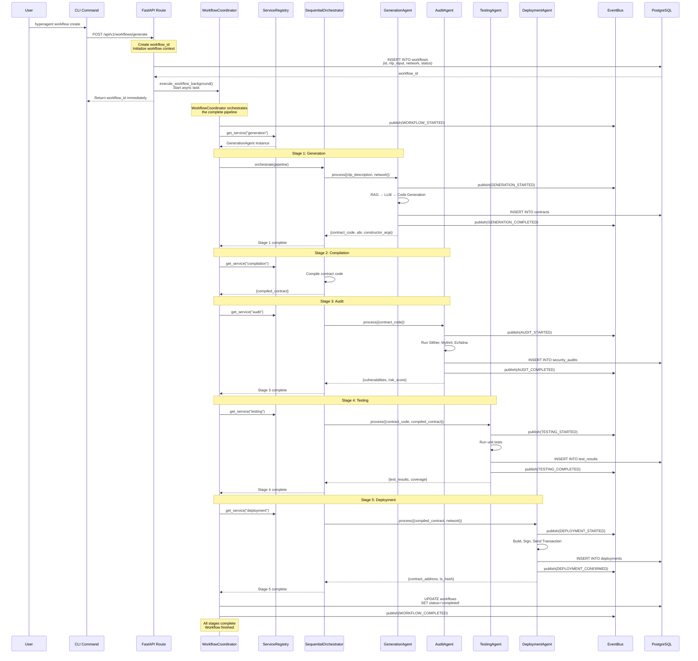

# Under the Hood: How HyperAgent Manages Workflows

## Overview

When you type `hyperagent workflow create`, a complex yet organized series of events unfolds to orchestrate the complete smart contract lifecycle.

## Diagram



## Workflow System Components

### 1. WorkflowCoordinator
```python
class WorkflowCoordinator:
    """Orchestrates complete workflow pipeline"""
    
    async def execute_workflow(self, workflow_id, nlp_input, network):
        # Define pipeline stages
        pipeline = [
            {"service": "generation", ...},
            {"service": "compilation", ...},
            {"service": "audit", ...},
            {"service": "testing", ...},
            {"service": "deployment", ...}
        ]
        
        # Execute sequentially
        result = await self.orchestrator.orchestrate(pipeline)
        return result
```

### 2. SequentialOrchestrator
```python
class SequentialOrchestrator:
    """Executes services one after another"""
    
    async def orchestrate(self, workflow_context):
        for stage in pipeline:
            service = self.registry.get_service(stage["service"])
            
            # Validate input
            if not await service.validate(request):
                raise ValueError("Validation failed")
            
            # Execute service
            result = await service.process(request)
            
            # Update progress
            await self.progress_callback(status, progress)
            
            # Publish event
            await self.event_bus.publish(progress_event)
```

### 3. ServiceRegistry
```python
class ServiceRegistry:
    """Central registry for service lookup"""
    
    def register(self, name, service, metadata=None):
        self._services[name] = service
        self._metadata[name] = metadata
    
    def get_service(self, name):
        if name not in self._services:
            raise ValueError(f"Service '{name}' not found")
        return self._services[name]
```

## Pipeline Stages

### Stage 1: Generation (20% progress)
- **Service**: GenerationAgent
- **Input**: `{nlp_description, network, contract_type}`
- **Process**: RAG → LLM → Code Generation
- **Output**: `{contract_code, abi, constructor_args}`
- **SLA**: p99 < 45s

### Stage 2: Compilation (40% progress)
- **Service**: CompilationService
- **Input**: `{contract_code}`
- **Process**: Solidity compilation
- **Output**: `{compiled_contract: {abi, bytecode}}`

### Stage 3: Audit (60% progress)
- **Service**: AuditAgent
- **Input**: `{contract_code}`
- **Process**: Slither, Mythril, Echidna
- **Output**: `{vulnerabilities, risk_score}`
- **SLA**: p99 < 60s

### Stage 4: Testing (80% progress)
- **Service**: TestingAgent
- **Input**: `{contract_code, compiled_contract}`
- **Process**: Unit tests execution
- **Output**: `{test_results, coverage}`
- **SLA**: p99 < 90s

### Stage 5: Deployment (100% progress)
- **Service**: DeploymentAgent
- **Input**: `{compiled_contract, network, constructor_args}`
- **Process**: Build → Sign → Send → Confirm
- **Output**: `{contract_address, tx_hash, block_number}`
- **SLA**: p99 < 300s

## State Management

### Workflow States
```python
class WorkflowStatus(Enum):
    CREATED = "created"
    NLP_PARSING = "nlp_parsing"
    GENERATING = "generating"
    AUDITING = "auditing"
    TESTING = "testing"
    DEPLOYING = "deploying"
    COMPLETED = "completed"
    FAILED = "failed"
    CANCELLED = "cancelled"
```

### Progress Tracking
- **Progress Percentage**: 0-100%
- **Current Stage**: Active stage name
- **Updated At**: Last update timestamp
- **Error Tracking**: Error message and stacktrace

## Error Handling

### Retry Logic
```python
# Exponential backoff retry
retry_count = 0
max_retries = 3

while retry_count < max_retries:
    try:
        result = await service.process(input_data)
        break
    except Exception as e:
        retry_count += 1
        wait_time = 2 ** retry_count  # Exponential backoff
        await asyncio.sleep(wait_time)
```

### Error Events
- `WORKFLOW_FAILED` - Workflow failed with error
- `GENERATION_FAILED` - Generation stage failed
- `AUDIT_FAILED` - Audit stage failed
- `TESTING_FAILED` - Testing stage failed
- `DEPLOYMENT_FAILED` - Deployment stage failed

## Benefits

- **Sequential Execution**: Stages run in order
- **State Persistence**: Workflow state saved to database
- **Progress Tracking**: Real-time progress updates
- **Error Recovery**: Retry logic with exponential backoff
- **Event-Driven**: Events published for each stage
- **Scalable**: Services can be scaled independently

