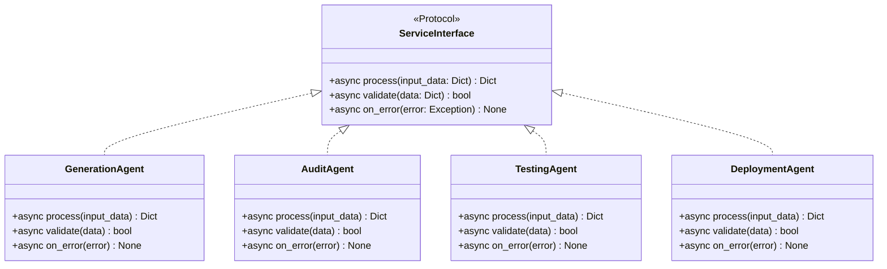
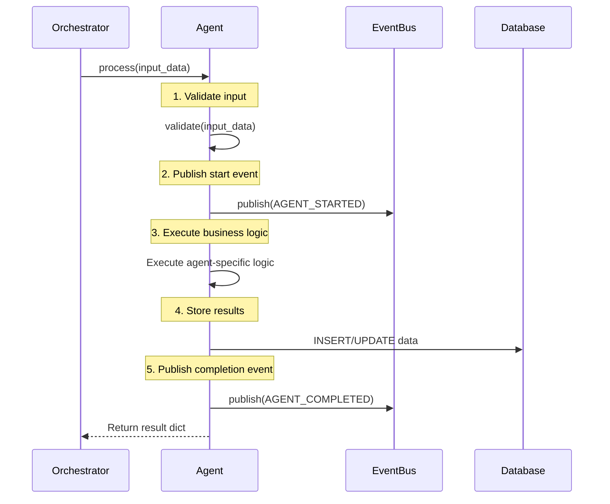
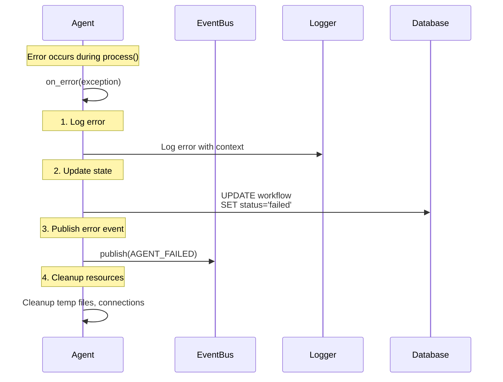
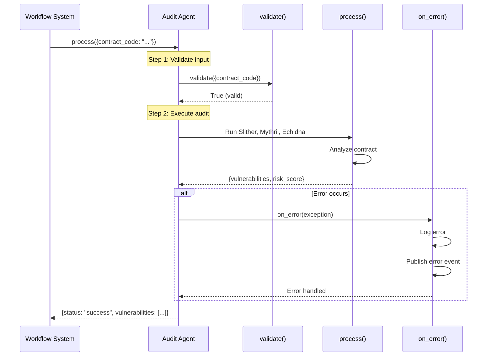

# Under the Hood: The Three Core Duties of Every Agent

## Overview

All agents in HyperAgent implement the `ServiceInterface` protocol, which defines three core methods that every agent must provide.

## Diagram



## The Three Core Methods

### 1. `process(input_data: Dict[str, Any]) -> Dict[str, Any]`

**Purpose**: Execute the agent's main functionality

**Flow**:


**Example - GenerationAgent**:
```python
async def process(self, input_data: Dict[str, Any]) -> Dict[str, Any]:
    # 1. Validate
    if not await self.validate(input_data):
        raise ValueError("Invalid input")
    
    # 2. Publish start event
    await self.event_bus.publish(Event(
        type=EventType.GENERATION_STARTED,
        workflow_id=input_data["workflow_id"],
        ...
    ))
    
    # 3. Execute logic
    contract_code = await self.template_retriever.retrieve_and_generate(...)
    
    # 4. Store results
    # (handled by service layer)
    
    # 5. Publish completion
    await self.event_bus.publish(Event(
        type=EventType.GENERATION_COMPLETED,
        ...
    ))
    
    # 6. Return result
    return {
        "status": "success",
        "contract_code": contract_code,
        "abi": abi,
        ...
    }
```

### 2. `validate(data: Dict[str, Any]) -> bool`

**Purpose**: Validate input data before processing

**Flow**:
```mermaid
flowchart TD
    START[Input Data Received]
    VALIDATE{validate() called}
    CHECK1{Required fields present?}
    CHECK2{Field types correct?}
    CHECK3{Values within range?}
    PASS[Return True]
    FAIL[Return False]
    
    START --> VALIDATE
    VALIDATE --> CHECK1
    CHECK1 -->|Yes| CHECK2
    CHECK1 -->|No| FAIL
    CHECK2 -->|Yes| CHECK3
    CHECK2 -->|No| FAIL
    CHECK3 -->|Yes| PASS
    CHECK3 -->|No| FAIL
```

**Example - AuditAgent**:
```python
async def validate(self, data: Dict[str, Any]) -> bool:
    # Check required fields
    if not data.get("contract_code"):
        return False
    
    # Check data types
    if not isinstance(data["contract_code"], str):
        return False
    
    # Check value constraints
    if len(data["contract_code"]) < 10:
        return False
    
    return True
```

### 3. `on_error(error: Exception) -> None`

**Purpose**: Handle errors gracefully

**Flow**:


**Example - DeploymentAgent**:
```python
async def on_error(self, error: Exception):
    # 1. Log error
    logger.error(
        f"Deployment error for workflow {self.workflow_id}",
        exc_info=error,
        extra={
            "workflow_id": self.workflow_id,
            "network": self.network
        }
    )
    
    # 2. Publish error event
    await self.event_bus.publish(Event(
        type=EventType.DEPLOYMENT_FAILED,
        workflow_id=self.workflow_id,
        data={"error": str(error)},
        ...
    ))
    
    # 3. Cleanup
    if self.temp_files:
        for file in self.temp_files:
            os.remove(file)
```

## Agent Interaction Example

### Workflow System → Audit Agent



## ServiceInterface Protocol

```python
class ServiceInterface(Protocol):
    """Service contract - all services must implement"""
    
    async def process(self, input_data: Dict[str, Any]) -> Dict[str, Any]:
        """
        Process input and return output
        
        Logic Flow:
        1. Validate input_data
        2. Execute business logic
        3. Return structured output
        4. Handle errors gracefully
        """
        ...
    
    async def validate(self, data: Dict[str, Any]) -> bool:
        """Validate input data before processing"""
        ...
    
    async def on_error(self, error: Exception) -> None:
        """Handle service-specific errors"""
        ...
```

## Benefits

- **Consistency**: All agents follow the same interface
- **Error Handling**: Standardized error handling pattern
- **Validation**: Input validation before processing
- **Event Publishing**: Consistent event publishing
- **Testability**: Easy to test with mock implementations
- **Extensibility**: Easy to add new agents

## Agent Responsibilities

### GenerationAgent
- **process**: Generate contract code from NLP
- **validate**: Check NLP input is valid
- **on_error**: Handle generation failures

### AuditAgent
- **process**: Run security analysis
- **validate**: Check contract code exists
- **on_error**: Handle audit tool failures

### TestingAgent
- **process**: Run unit tests
- **validate**: Check contract is compilable
- **on_error**: Handle test execution failures

### DeploymentAgent
- **process**: Deploy contract to blockchain
- **validate**: Check compiled contract and network
- **on_error**: Handle deployment failures

