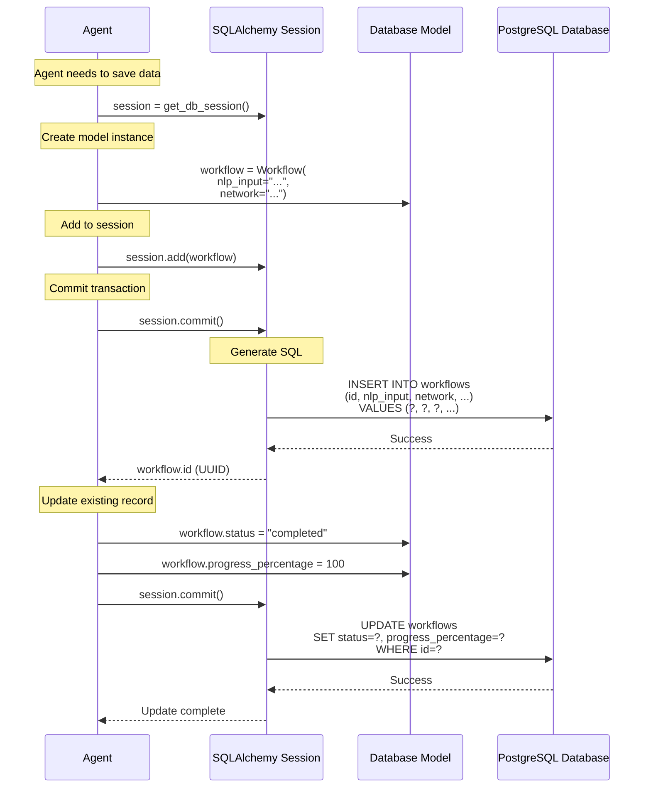
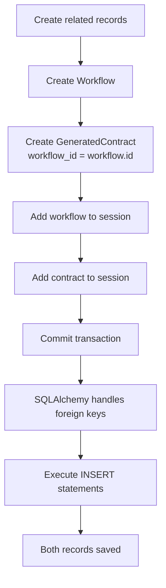

# Under the Hood: SQLAlchemy and HyperAgent's Models

## Overview

HyperAgent uses SQLAlchemy ORM to define database models and manage data persistence. Models represent workflows, contracts, deployments, and templates.

## Diagram



## Model Definition

### Workflow Model
```python
class Workflow(Base):
    """Workflow database model"""
    __tablename__ = "workflows"
    __table_args__ = {"schema": "hyperagent"}
    
    # Primary Key
    id = Column(UUID(as_uuid=True), primary_key=True, default=uuid.uuid4)
    
    # Foreign Keys
    user_id = Column(UUID(as_uuid=True), ForeignKey("hyperagent.users.id"))
    
    # Basic Fields
    name = Column(String(255), nullable=False)
    description = Column(Text)
    status = Column(String(50), default=WorkflowStatus.CREATED.value)
    progress_percentage = Column(Integer, default=0)
    
    # NLP Input
    nlp_input = Column(Text, nullable=False)
    nlp_tokens = Column(Integer)
    
    # Network
    network = Column(String(50), nullable=False)
    is_testnet = Column(Boolean, default=True)
    
    # Timestamps
    created_at = Column(DateTime(timezone=True), server_default=func.now())
    updated_at = Column(DateTime(timezone=True), onupdate=func.now())
    completed_at = Column(DateTime(timezone=True))
    
    # Error Tracking
    error_message = Column(Text)
    error_stacktrace = Column(Text)
    retry_count = Column(Integer, default=0)
    
    # Metadata (JSONB for flexible storage)
    meta_data = Column("metadata", JSONB, default={})
    
    # Relationships
    contracts = relationship("GeneratedContract", back_populates="workflow")
```

## Data Saving Process

### 1. Create New Record
```mermaid
flowchart TD
    START[Agent needs to save data]
    CREATE[Create model instance<br/>workflow = Workflow(...)]
    ADD[Add to session<br/>session.add(workflow)]
    COMMIT[Commit transaction<br/>session.commit()]
    SQL[SQLAlchemy generates SQL]
    EXEC[Execute INSERT statement]
    RETURN[Return model with ID]
    
    START --> CREATE
    CREATE --> ADD
    ADD --> COMMIT
    COMMIT --> SQL
    SQL --> EXEC
    EXEC --> RETURN
```

**Code Example**:
```python
# Create new workflow
workflow = Workflow(
    user_id=user_id,
    name="ERC20 Token Generation",
    nlp_input="Create ERC20 token with 1M supply",
    network="hyperion_testnet",
    status=WorkflowStatus.CREATED.value
)

# Add to session
session.add(workflow)

# Commit (triggers INSERT)
session.commit()

# Access generated ID
workflow_id = workflow.id  # UUID generated by database
```

### 2. Update Existing Record
```mermaid
flowchart TD
    START[Agent needs to update data]
    QUERY[Query existing record<br/>workflow = session.query(Workflow).get(id)]
    MODIFY[Modify attributes<br/>workflow.status = 'completed']
    COMMIT[Commit transaction<br/>session.commit()]
    SQL[SQLAlchemy generates SQL]
    EXEC[Execute UPDATE statement]
    RETURN[Update complete]
    
    START --> QUERY
    QUERY --> MODIFY
    MODIFY --> COMMIT
    COMMIT --> SQL
    SQL --> EXEC
    EXEC --> RETURN
```

**Code Example**:
```python
# Query existing workflow
workflow = session.query(Workflow).filter_by(id=workflow_id).first()

# Update fields
workflow.status = WorkflowStatus.COMPLETED.value
workflow.progress_percentage = 100
workflow.completed_at = datetime.now()

# Commit (triggers UPDATE)
session.commit()
```

### 3. Relationship Handling


**Code Example**:
```python
# Create workflow
workflow = Workflow(...)
session.add(workflow)
session.flush()  # Get workflow.id without committing

# Create related contract
contract = GeneratedContract(
    workflow_id=workflow.id,  # Foreign key
    code=contract_code,
    abi=abi
)
session.add(contract)

# Commit both
session.commit()
```

## Model Relationships

### One-to-Many: Workflow → Contracts
```python
# In Workflow model
contracts = relationship("GeneratedContract", back_populates="workflow")

# In GeneratedContract model
workflow_id = Column(UUID, ForeignKey("hyperagent.workflows.id"))
workflow = relationship("Workflow", back_populates="contracts")

# Usage
workflow = session.query(Workflow).get(workflow_id)
contracts = workflow.contracts  # Access related contracts
```

### Many-to-One: Contract → Workflow
```python
# Contract belongs to one workflow
contract = session.query(GeneratedContract).get(contract_id)
workflow = contract.workflow  # Access parent workflow
```

## Database Operations

### Query Operations
```python
# Get by ID
workflow = session.query(Workflow).get(workflow_id)

# Filter
workflows = session.query(Workflow).filter_by(
    status=WorkflowStatus.COMPLETED.value
).all()

# Complex query
workflows = session.query(Workflow).filter(
    Workflow.created_at > datetime.now() - timedelta(days=7),
    Workflow.status == WorkflowStatus.COMPLETED.value
).order_by(Workflow.created_at.desc()).limit(10).all()
```

### Bulk Operations
```python
# Bulk insert
workflows = [
    Workflow(...),
    Workflow(...),
    Workflow(...)
]
session.bulk_save_objects(workflows)
session.commit()

# Bulk update
session.query(Workflow).filter_by(
    status=WorkflowStatus.PENDING.value
).update({
    "status": WorkflowStatus.CANCELLED.value
})
session.commit()
```

## Async Database Operations

### AsyncSession Usage
```python
from sqlalchemy.ext.asyncio import AsyncSession

async def create_workflow(session: AsyncSession, nlp_input: str):
    workflow = Workflow(
        nlp_input=nlp_input,
        network="hyperion_testnet"
    )
    session.add(workflow)
    await session.commit()
    await session.refresh(workflow)  # Get generated ID
    return workflow
```

## Benefits

- **Type Safety**: Models are Python classes with type hints
- **Relationship Management**: Automatic foreign key handling
- **Query Building**: SQLAlchemy query builder
- **Migration Support**: Alembic for schema migrations
- **Connection Pooling**: Efficient database connections
- **Transaction Management**: Automatic transaction handling

