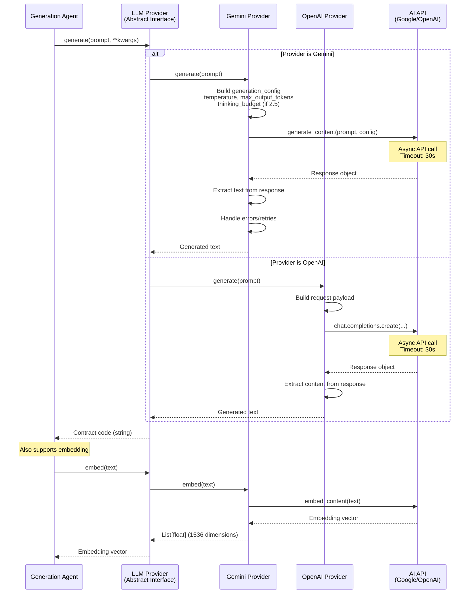
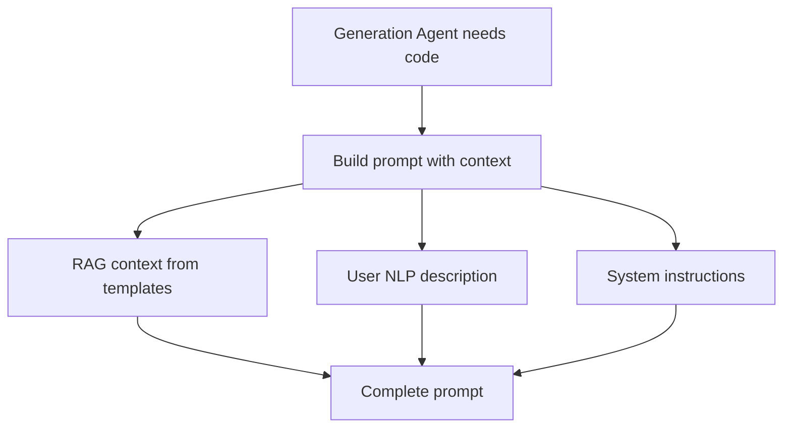
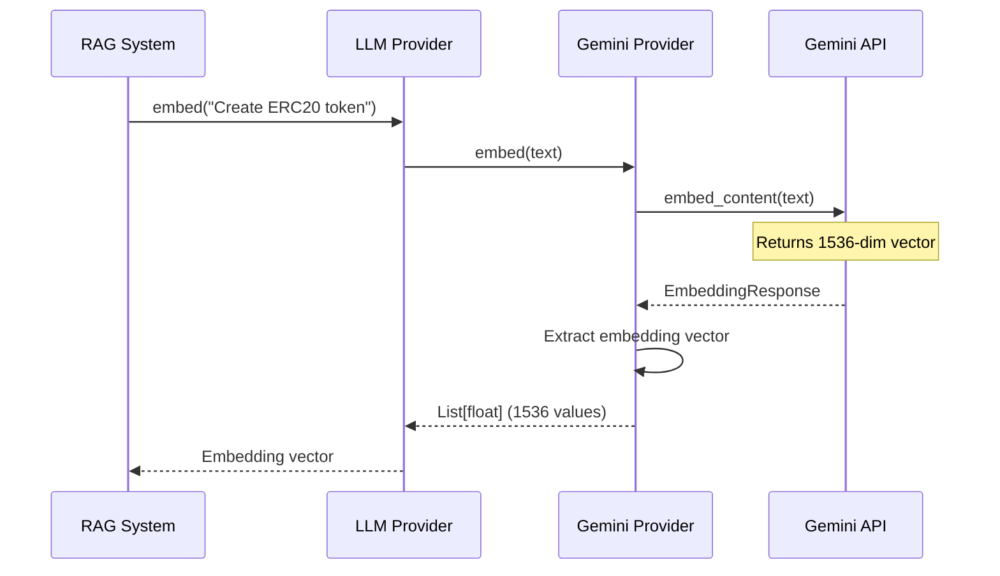

# Under the Hood: The LLM Provider in Action

## Overview

HyperAgent's LLM Provider is an abstraction layer that allows switching between different AI models (Gemini, OpenAI) with a consistent interface.

## Diagram



## LLM Provider Structure

### Abstract Interface
```python
class LLMProvider(ABC):
    """Abstract LLM provider interface"""
    
    @abstractmethod
    async def generate(self, prompt: str, **kwargs) -> str:
        """Generate text from prompt"""
        pass
    
    @abstractmethod
    async def embed(self, text: str) -> List[float]:
        """Generate embedding vector"""
        pass
```

### Gemini Provider Implementation
```python
class GeminiProvider(LLMProvider):
    """Google Gemini Provider"""
    
    def __init__(self, api_key: str, model_name: str = "gemini-2.5-flash"):
        import google.generativeai as genai
        genai.configure(api_key=api_key)
        self.model = genai.GenerativeModel(model_name)
        self.model_name = model_name
    
    async def generate(self, prompt: str, **kwargs) -> str:
        # Build generation config
        generation_config = {
            "temperature": kwargs.get("temperature", 0.3),
            "max_output_tokens": kwargs.get("max_output_tokens", 8000)
        }
        
        # Add thinking budget for Gemini 2.5
        if "2.5" in self.model_name:
            thinking_budget = kwargs.get("thinking_budget", self.thinking_budget)
            if thinking_budget:
                generation_config["thinking_budget"] = thinking_budget
        
        # Call API with timeout
        loop = asyncio.get_event_loop()
        response = await asyncio.wait_for(
            loop.run_in_executor(
                None,
                lambda: self.model.generate_content(prompt, generation_config)
            ),
            timeout=settings.llm_timeout_seconds
        )
        
        return response.text
```

## AI Communication Flow

### 1. Prompt Construction


### 2. API Call with Timeout
```mermaid
flowchart TD
    START[Call generate()]
    CONFIG[Build generation config]
    EXEC[Execute in thread pool]
    TIMEOUT{Timeout<br/>30s?}
    API[Call AI API]
    RESPONSE{Response<br/>received?}
    RETRY{Retry<br/>count < 3?}
    ERROR[Raise LLMError]
    SUCCESS[Return text]
    
    START --> CONFIG
    CONFIG --> EXEC
    EXEC --> TIMEOUT
    TIMEOUT -->|No timeout| API
    TIMEOUT -->|Timeout| ERROR
    API --> RESPONSE
    RESPONSE -->|Yes| SUCCESS
    RESPONSE -->|No| RETRY
    RETRY -->|Yes| EXEC
    RETRY -->|No| ERROR
```

### 3. Response Processing
```python
# Extract text from response
response_text = response.text

# Handle markdown code blocks
if "```solidity" in response_text:
    # Extract code from markdown
    code = extract_solidity_code(response_text)
else:
    code = response_text

return code
```

## Embedding Generation

### Embedding Flow


**Code Example**:
```python
async def embed(self, text: str) -> List[float]:
    """Generate embedding vector"""
    loop = asyncio.get_event_loop()
    
    response = await asyncio.wait_for(
        loop.run_in_executor(
            None,
            lambda: self.model.embed_content(text)
        ),
        timeout=settings.llm_embed_timeout_seconds  # 10s
    )
    
    return response['values']  # 1536-dimensional vector
```

## Error Handling

### Retry Logic
```python
async def generate(self, prompt: str, **kwargs) -> str:
    max_retries = 3
    retry_count = 0
    
    while retry_count < max_retries:
        try:
            response = await self._call_api(prompt, **kwargs)
            return response.text
        except Exception as e:
            retry_count += 1
            if retry_count >= max_retries:
                raise LLMError(f"Failed after {max_retries} retries: {e}")
            await asyncio.sleep(2 ** retry_count)  # Exponential backoff
```

### Timeout Handling
```python
try:
    response = await asyncio.wait_for(
        api_call,
        timeout=settings.llm_timeout_seconds  # 30s default
    )
except asyncio.TimeoutError:
    raise LLMError("LLM API call timed out")
```

## Provider Factory

### Factory Pattern
```python
class LLMProviderFactory:
    """Factory for creating LLM providers"""
    
    @staticmethod
    def create(provider_name: str, **kwargs) -> LLMProvider:
        if provider_name == "gemini":
            return GeminiProvider(
                api_key=kwargs["api_key"],
                model_name=kwargs.get("model", "gemini-2.5-flash")
            )
        elif provider_name == "openai":
            return OpenAIProvider(
                api_key=kwargs["api_key"],
                model_name=kwargs.get("model", "gpt-4o")
            )
        else:
            raise ValueError(f"Unknown provider: {provider_name}")
```

## Configuration

### Model Selection
```python
# Gemini models
"gemini-2.5-flash"        # Default, fastest, recommended
"gemini-2.5-flash-lite"   # Lighter, faster
"gemini-2.0-flash"        # Previous generation
"gemini-2.0-flash-lite"   # Previous generation, lighter

# OpenAI models
"gpt-4o"                  # Latest GPT-4
"gpt-4-turbo"             # GPT-4 Turbo
```

### Generation Parameters
```python
generation_config = {
    "temperature": 0.3,           # Creativity (0-1)
    "max_output_tokens": 8000,     # Max response length
    "thinking_budget": 100         # For Gemini 2.5 (1-1000)
}
```

## Benefits

- **Abstraction**: Consistent interface for different providers
- **Flexibility**: Easy to switch between Gemini and OpenAI
- **Error Handling**: Robust retry and timeout logic
- **Performance**: Async operations with timeout
- **Extensibility**: Easy to add new providers
- **Type Safety**: Typed return values

