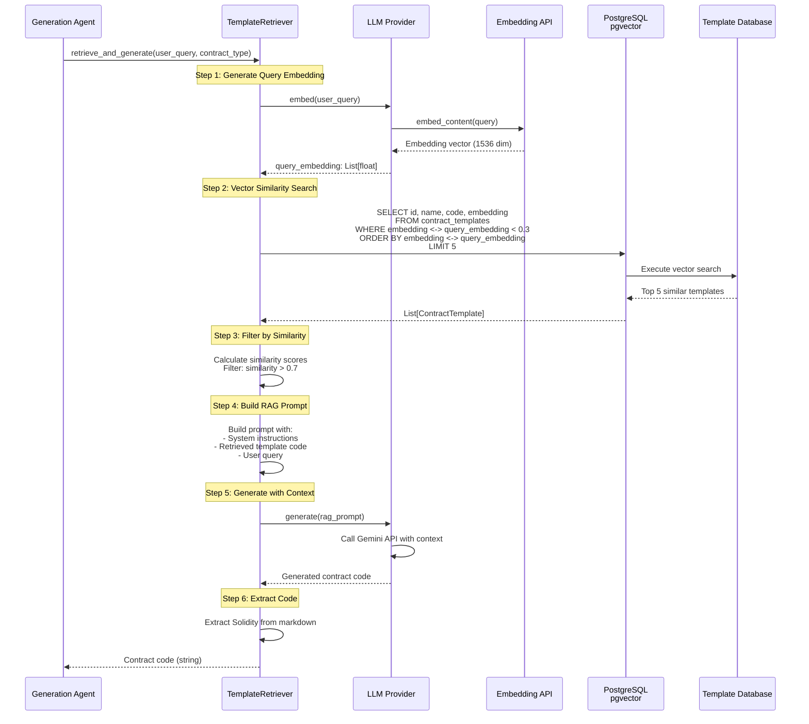
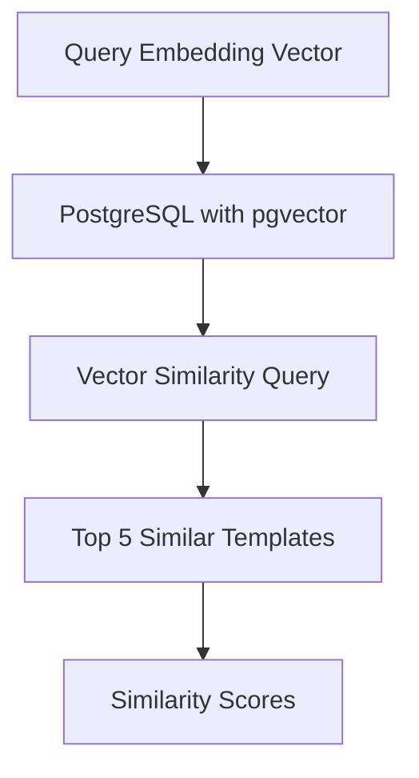
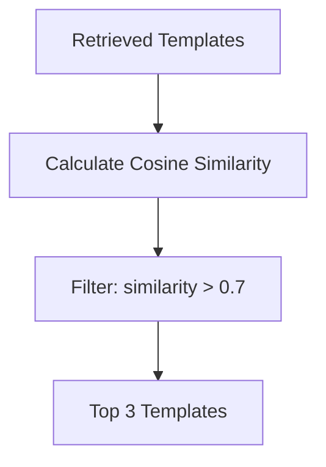
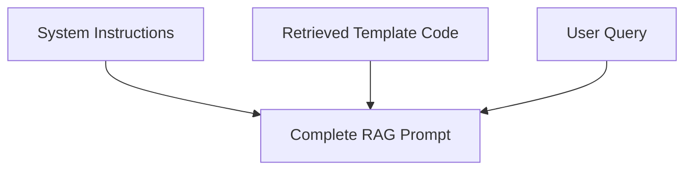
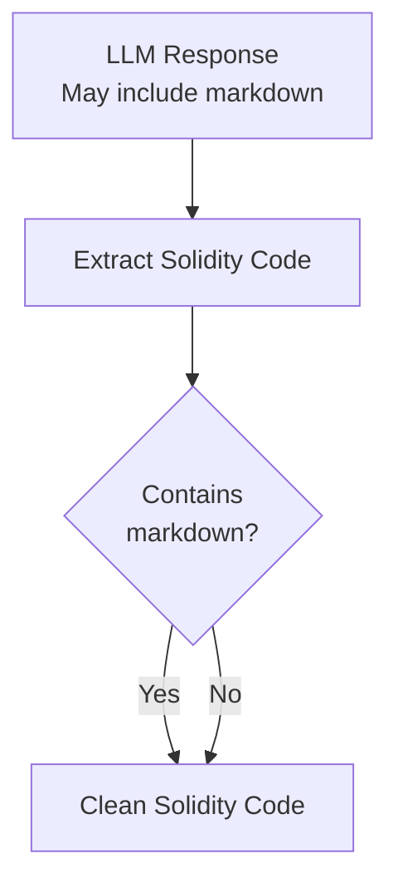

# Under the Hood: How HyperAgent Implements RAG

## Overview

HyperAgent's RAG (Retrieval-Augmented Generation) system converts user requests into embeddings, finds relevant templates using vector similarity, and uses those templates to guide the LLM.

## Diagram



## RAG Process Flow

### Step 1: Query Embedding Generation
```mermaid
flowchart TD
    START[User Query:<br/>"Create ERC20 token with burn"]
    LLM[LLM Provider embed()]
    API[Gemini Embedding API]
    VECTOR[1536-dim Vector<br/>[0.123, -0.456, ...]]
    
    START --> LLM
    LLM --> API
    API --> VECTOR
```

**Code**:
```python
# Generate query embedding
query_embedding = await self.llm_provider.embed(user_query)
# Returns: List[float] with 1536 dimensions
```

### Step 2: Vector Similarity Search


**SQL Query**:
```sql
SELECT 
    id, 
    name, 
    code, 
    embedding,
    1 - (embedding <-> $1::vector) AS similarity
FROM contract_templates
WHERE embedding <-> $1::vector < 0.3
ORDER BY embedding <-> $1::vector
LIMIT 5;
```

**Code**:
```python
# Vector similarity search
query = select(ContractTemplate).where(
    ContractTemplate.embedding.l2_distance(query_embedding) < 0.3
).order_by(
    ContractTemplate.embedding.l2_distance(query_embedding)
).limit(limit)

templates = await session.execute(query)
```

### Step 3: Similarity Calculation


**Similarity Formula**:
```python
def cosine_similarity(vec1, vec2):
    dot_product = sum(a * b for a, b in zip(vec1, vec2))
    magnitude1 = math.sqrt(sum(a * a for a in vec1))
    magnitude2 = math.sqrt(sum(a * a for a in vec2))
    return dot_product / (magnitude1 * magnitude2)
```

### Step 4: RAG Prompt Construction


**Prompt Structure**:
```python
prompt = f"""
You are an expert Solidity developer. Use the following contract templates as reference.

Template 1: ERC20 Basic
```solidity
{templates[0].code}
```

Template 2: ERC20 Burnable
```solidity
{templates[1].code}
```

User Request: {user_query}

Generate a Solidity contract that:
- Follows the patterns from the templates
- Implements the user's requirements
- Is production-ready and secure
"""
```

### Step 5: LLM Generation with Context
```mermaid
flowchart TD
    PROMPT[RAG Prompt with Templates]
    LLM[LLM Provider generate()]
    API[Gemini API]
    RESPONSE[Generated Code]
    
    PROMPT --> LLM
    LLM --> API
    API --> RESPONSE
```

**Code**:
```python
# Generate with RAG context
contract_code = await self.llm_provider.generate(rag_prompt)
```

### Step 6: Code Extraction


**Code**:
```python
def _extract_solidity_code(self, text: str) -> str:
    # Extract from markdown code blocks
    if "```solidity" in text:
        import re
        match = re.search(r'```solidity\n(.*?)\n```', text, re.DOTALL)
        if match:
            return match.group(1).strip()
    return text.strip()
```

## Complete RAG Pipeline

```mermaid
flowchart LR
    A[User Query] --> B[Generate Embedding]
    B --> C[Vector Search]
    C --> D[Filter Templates]
    D --> E[Build RAG Prompt]
    E --> F[LLM Generation]
    F --> G[Extract Code]
    G --> H[Contract Ready]
    
    style A fill:#e1f5ff
    style B fill:#f0e6ff
    style C fill:#d4edda
    style D fill:#fff3cd
    style E fill:#ffeaa7
    style F fill:#f0e6ff
    style G fill:#d1ecf1
    style H fill:#d4edda
```



## Template Database Schema

```sql
CREATE TABLE contract_templates (
    id UUID PRIMARY KEY,
    name VARCHAR(255) NOT NULL,
    contract_type VARCHAR(100),
    code TEXT NOT NULL,
    embedding vector(1536),  -- pgvector column
    description TEXT,
    tags TEXT[],
    created_at TIMESTAMP DEFAULT NOW()
);

-- Create vector index for fast similarity search
CREATE INDEX ON contract_templates 
    USING ivfflat (embedding vector_cosine_ops)
    WITH (lists = 100);
```

## Performance Optimizations

### Vector Index
- **IVFFlat Index**: Fast approximate nearest neighbor search
- **Lists Parameter**: 100 lists for good balance of speed/accuracy
- **Query Time**: < 50ms for similarity search

### Caching
- **Template Cache**: Cache frequently accessed templates
- **Embedding Cache**: Cache query embeddings
- **TTL**: 1 hour cache expiration

## Benefits

- **Better Code Quality**: Templates provide proven patterns
- **Consistency**: Follows established contract structures
- **Reduced Errors**: Template-based generation is more reliable
- **Context-Aware**: LLM has relevant examples
- **Scalable**: Vector search is fast even with thousands of templates
- **Flexible**: Easy to add new templates

