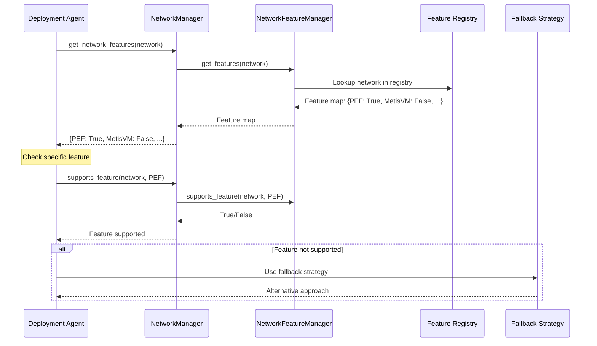
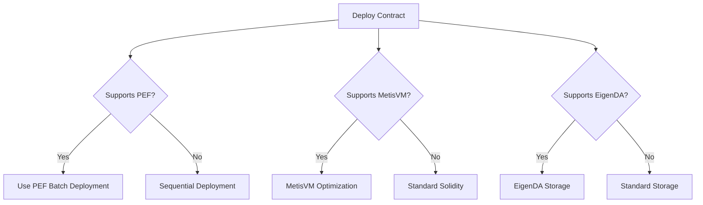
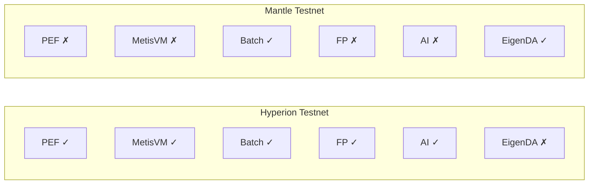

# Under the Hood: The Blockchain Network Management System

## Overview

HyperAgent's Network Management system uses a central registry of networks and their capabilities, making it easy to query and adapt to different blockchain networks.

## Diagram

```mermaid
graph TB
    subgraph "Network Registry"
        NR[NetworkFeatureManager<br/>Central Registry]
        NF[NetworkFeature Enum<br/>PEF, MetisVM, EigenDA<br/>Batch Deployment<br/>Floating Point<br/>AI Inference]
    end

    subgraph "Network Configurations"
        HYPER[Hyperion Testnet<br/>Chain ID: 133717<br/>RPC: hyperion-testnet.metisdevops.link]
        MANTLE[Mantle Testnet<br/>Chain ID: 5003<br/>RPC: rpc.sepolia.mantle.xyz]
        HYPER_MAIN[Hyperion Mainnet<br/>Chain ID: 1337<br/>RPC: mainnet RPC]
        MANTLE_MAIN[Mantle Mainnet<br/>Chain ID: 5000<br/>RPC: mainnet RPC]
    end

    subgraph "Network Manager"
        NM[NetworkManager<br/>Web3 Instance Management]
        W3[Web3 Instances<br/>Cached per network]
    end

    subgraph "Feature Detection"
        CHECK[supports_feature(network, feature)]
        FALLBACK[Fallback Strategies<br/>Graceful degradation]
    end

    NR --> NF
    NR --> HYPER
    NR --> MANTLE
    NR --> HYPER_MAIN
    NR --> MANTLE_MAIN
    
    NM --> W3
    NM --> CHECK
    CHECK --> FALLBACK
```

## How HyperAgent Checks Network Features

### Feature Check Flow


## Network Feature Registry

### Feature Definitions
```python
class NetworkFeature(Enum):
    """Network feature capabilities"""
    PEF = "pef"                          # Parallel Execution Framework
    METISVM = "metisvm"                  # MetisVM optimization
    EIGENDA = "eigenda"                  # EigenDA data availability
    BATCH_DEPLOYMENT = "batch_deployment" # Batch contract deployment
    FLOATING_POINT = "floating_point"    # Floating-point arithmetic
    AI_INFERENCE = "ai_inference"        # AI inference support
```

### Network Configuration
```python
NETWORK_FEATURES = {
    "hyperion_testnet": {
        "chain_id": 133717,
        "rpc_url": "https://hyperion-testnet.metisdevops.link",
        "explorer": "https://explorer.hyperion-testnet.metisdevops.link",
        "currency": "ETH",
        "features": {
            NetworkFeature.PEF: True,
            NetworkFeature.METISVM: True,
            NetworkFeature.EIGENDA: False,
            NetworkFeature.BATCH_DEPLOYMENT: True,
            NetworkFeature.FLOATING_POINT: True,
            NetworkFeature.AI_INFERENCE: True
        },
        "fallback_strategies": {
            "eigenda": "Use standard data storage"
        }
    },
    "mantle_testnet": {
        "chain_id": 5003,
        "rpc_url": "https://rpc.sepolia.mantle.xyz",
        "explorer": "https://explorer.sepolia.mantle.xyz",
        "currency": "MNT",
        "features": {
            NetworkFeature.PEF: False,
            NetworkFeature.METISVM: False,
            NetworkFeature.EIGENDA: True,
            NetworkFeature.BATCH_DEPLOYMENT: True,
            NetworkFeature.FLOATING_POINT: False,
            NetworkFeature.AI_INFERENCE: False
        },
        "fallback_strategies": {
            "pef": "Use sequential deployment",
            "metisvm": "Use standard Solidity",
            "floating_point": "Use fixed-point arithmetic"
        }
    }
}
```

## Network Manager Usage

### Get Web3 Instance
```python
class NetworkManager:
    """Manage Web3 connections to different networks"""
    
    def __init__(self):
        self._instances: Dict[str, Web3] = {}
    
    def get_web3(self, network: str) -> Web3:
        """Get or create Web3 instance for network"""
        if network not in self._instances:
            config = NETWORKS[network]
            self._instances[network] = Web3(
                Web3.HTTPProvider(config["rpc_url"])
            )
        return self._instances[network]
```

### Feature Checking
```python
def supports_feature(self, network: str, feature: NetworkFeature) -> bool:
    """Check if network supports a specific feature"""
    return NetworkFeatureManager.supports_feature(network, feature)

# Usage
if network_manager.supports_feature("hyperion_testnet", NetworkFeature.PEF):
    # Use PEF for batch deployment
    deploy_with_pef(contracts)
else:
    # Fallback to sequential deployment
    deploy_sequential(contracts)
```

## Feature Detection Example

### Deployment with Feature Check


**Code Example**:
```python
async def deploy(self, network: str, contract: Dict):
    network_manager = NetworkManager()
    
    # Check features
    supports_pef = network_manager.supports_feature(
        network, NetworkFeature.PEF
    )
    supports_metisvm = network_manager.supports_feature(
        network, NetworkFeature.METISVM
    )
    
    # Adapt deployment strategy
    if supports_pef:
        return await self.deploy_with_pef(contract)
    else:
        return await self.deploy_sequential(contract)
```

## Fallback Strategies

### Graceful Degradation
```python
def get_deployment_strategy(self, network: str):
    """Get deployment strategy based on network features"""
    features = NetworkFeatureManager.get_features(network)
    
    if features[NetworkFeature.PEF]:
        return "pef_batch"  # Fast parallel deployment
    else:
        return "sequential"  # Standard sequential deployment

def get_optimization_strategy(self, network: str):
    """Get optimization strategy based on network features"""
    features = NetworkFeatureManager.get_features(network)
    
    if features[NetworkFeature.METISVM]:
        return "metisvm_optimized"  # MetisVM-specific optimizations
    else:
        return "standard"  # Standard Solidity
```

## Network Compatibility

### Compatibility Matrix


## Benefits

- **Centralized Configuration**: All network info in one place
- **Feature Detection**: Easy to check capabilities
- **Graceful Degradation**: Automatic fallbacks
- **Extensibility**: Easy to add new networks
- **Type Safety**: Enum-based feature definitions
- **Performance**: Cached Web3 instances

