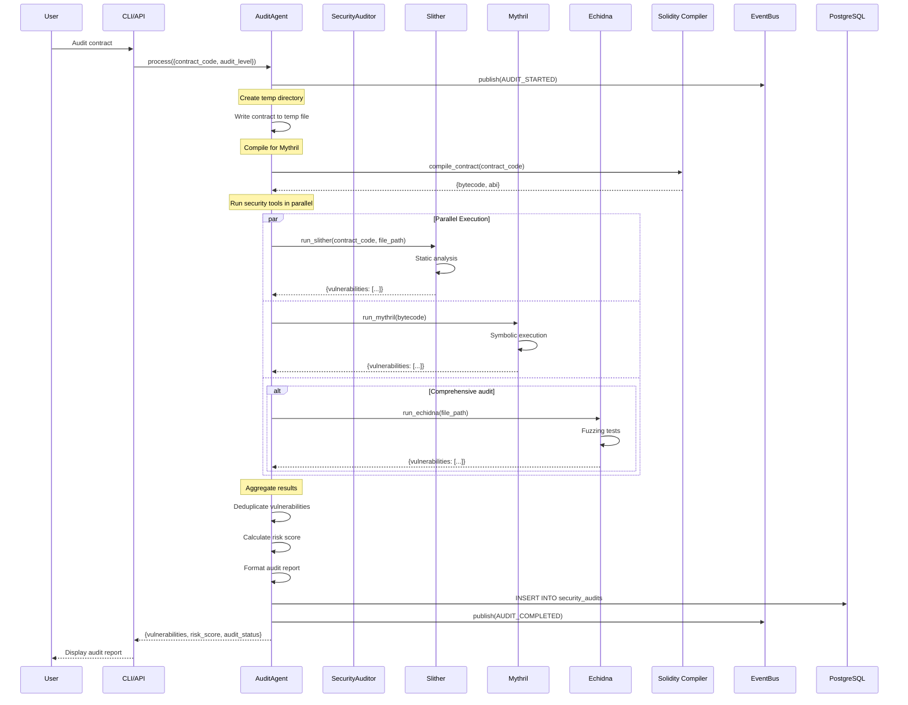
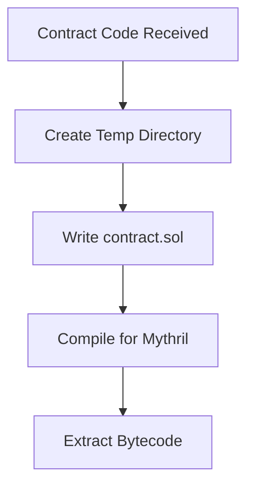
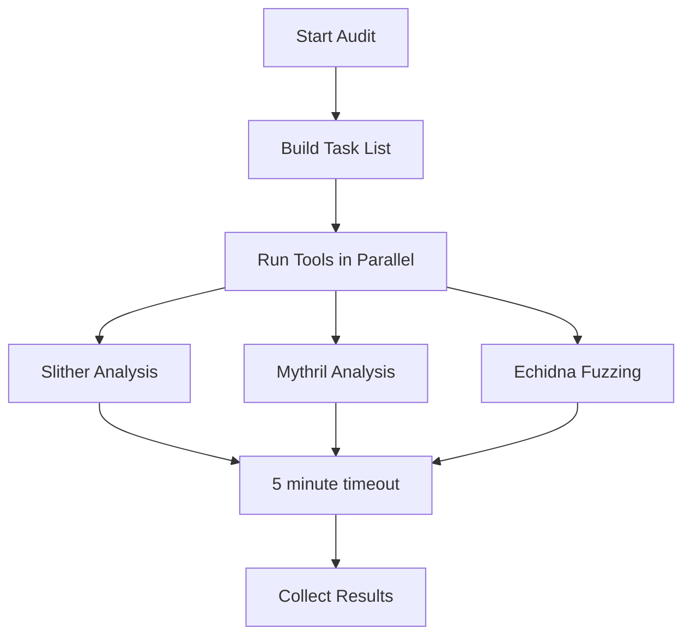
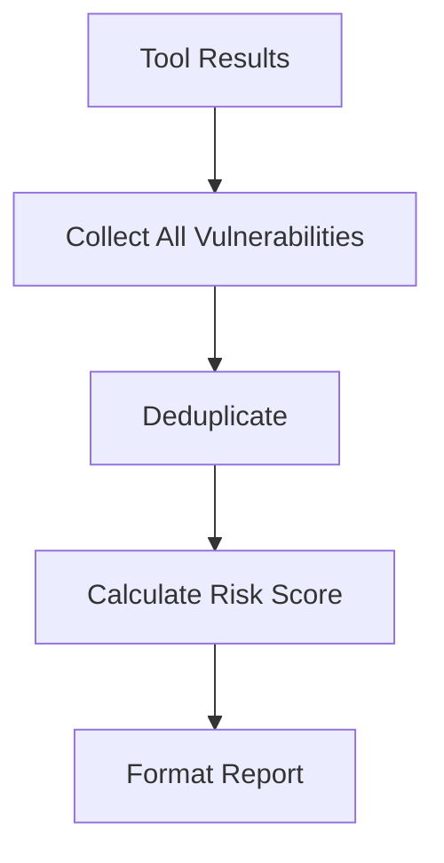

# Under the Hood: How HyperAgent Audits Contracts

## Overview

When you initiate an audit (either directly via CLI or as part of a workflow), HyperAgent's Security Auditor coordinates multiple security tools to perform comprehensive contract analysis.

## Diagram



## Audit Process Flow

### 1. Contract Preparation


**Code**:
```python
# Create temp directory
with tempfile.TemporaryDirectory() as temp_dir:
    temp_path = Path(temp_dir)
    contract_file = temp_path / "contract.sol"
    contract_file.write_text(contract_code)
    
    # Compile for Mythril (needs bytecode)
    compilation_result = await self.auditor.compile_contract(contract_code)
    bytecode = compilation_result.get("bytecode")
```

### 2. Parallel Tool Execution


**Code**:
```python
# Build task list
tasks = [
    self.auditor.run_slither(contract_code, str(contract_file))
]

if bytecode:
    tasks.append(self.auditor.run_mythril(bytecode))

if audit_level == "comprehensive":
    tasks.append(self.auditor.run_echidna(str(contract_file)))

# Run in parallel with timeout
results = await asyncio.wait_for(
    asyncio.gather(*tasks, return_exceptions=True),
    timeout=300  # 5 minute timeout
)
```

### 3. Vulnerability Aggregation


**Risk Score Calculation**:
```python
def _calculate_risk_score(self, vulnerabilities: List[Dict]) -> int:
    """Calculate overall risk score (0-100)"""
    score = 0
    
    for vuln in vulnerabilities:
        severity = vuln.get("severity", "info")
        if severity == "critical":
            score += 25
        elif severity == "high":
            score += 15
        elif severity == "medium":
            score += 5
        elif severity == "low":
            score += 1
    
    return min(score, 100)  # Cap at 100
```

## Security Tools

### Slither (Static Analysis)
```python
async def run_slither(self, contract_code: str, file_path: str) -> Dict:
    """Run Slither static analysis"""
    import subprocess
    
    result = subprocess.run(
        ["slither", file_path, "--json", "-"],
        capture_output=True,
        text=True,
        timeout=120
    )
    
    # Parse JSON output
    slither_data = json.loads(result.stdout)
    
    # Extract vulnerabilities
    vulnerabilities = []
    for detector in slither_data.get("results", {}).get("detectors", []):
        vulnerabilities.append({
            "tool": "slither",
            "severity": detector["impact"],
            "title": detector["check"],
            "description": detector["description"]
        })
    
    return {
        "tool": "slither",
        "status": "success",
        "vulnerabilities": vulnerabilities
    }
```

### Mythril (Symbolic Execution)
```python
async def run_mythril(self, bytecode: str) -> Dict:
    """Run Mythril symbolic execution"""
    import subprocess
    
    result = subprocess.run(
        ["mythril", "analyze", "-c", bytecode, "--json"],
        capture_output=True,
        text=True,
        timeout=180
    )
    
    # Parse JSON output
    mythril_data = json.loads(result.stdout)
    
    # Extract vulnerabilities
    vulnerabilities = []
    for issue in mythril_data.get("issues", []):
        vulnerabilities.append({
            "tool": "mythril",
            "severity": issue["severity"],
            "title": issue["title"],
            "description": issue["description"]
        })
    
    return {
        "tool": "mythril",
        "status": "success",
        "vulnerabilities": vulnerabilities
    }
```

### Echidna (Fuzzing)
```python
async def run_echidna(self, file_path: str) -> Dict:
    """Run Echidna fuzzing tests"""
    import subprocess
    
    # Create Echidna config
    config = {
        "testMode": "property",
        "testLimit": 50000
    }
    
    result = subprocess.run(
        ["echidna", file_path, "--config", json.dumps(config)],
        capture_output=True,
        text=True,
        timeout=300
    )
    
    # Parse output
    vulnerabilities = []
    # Extract found issues from output
    
    return {
        "tool": "echidna",
        "status": "success",
        "vulnerabilities": vulnerabilities
    }
```

## Audit Result Structure

```python
{
    "status": "success",
    "vulnerabilities": [
        {
            "tool": "slither",
            "severity": "high",
            "title": "Reentrancy",
            "description": "External call in a loop"
        },
        ...
    ],
    "overall_risk_score": 45,
    "audit_status": "warning",  # passed, warning, failed
    "critical_count": 0,
    "high_count": 2,
    "medium_count": 5,
    "low_count": 3,
    "info_count": 1,
    "tool_results": {
        "slither": {...},
        "mythril": {...},
        "echidna": {...}
    },
    "report": "Formatted audit report text"
}
```

## Audit Levels

### Standard Audit
- **Tools**: Slither, Mythril
- **Time**: ~2-3 minutes
- **Coverage**: Static analysis + symbolic execution

### Comprehensive Audit
- **Tools**: Slither, Mythril, Echidna
- **Time**: ~5 minutes
- **Coverage**: Static + symbolic + fuzzing

## Benefits

- **Comprehensive**: Multiple tools for thorough analysis
- **Parallel Execution**: Fast results with concurrent tools
- **Risk Scoring**: Quantified risk assessment
- **Deduplication**: Removes duplicate findings
- **Detailed Reports**: Human-readable audit reports
- **Database Storage**: Audit results persisted

