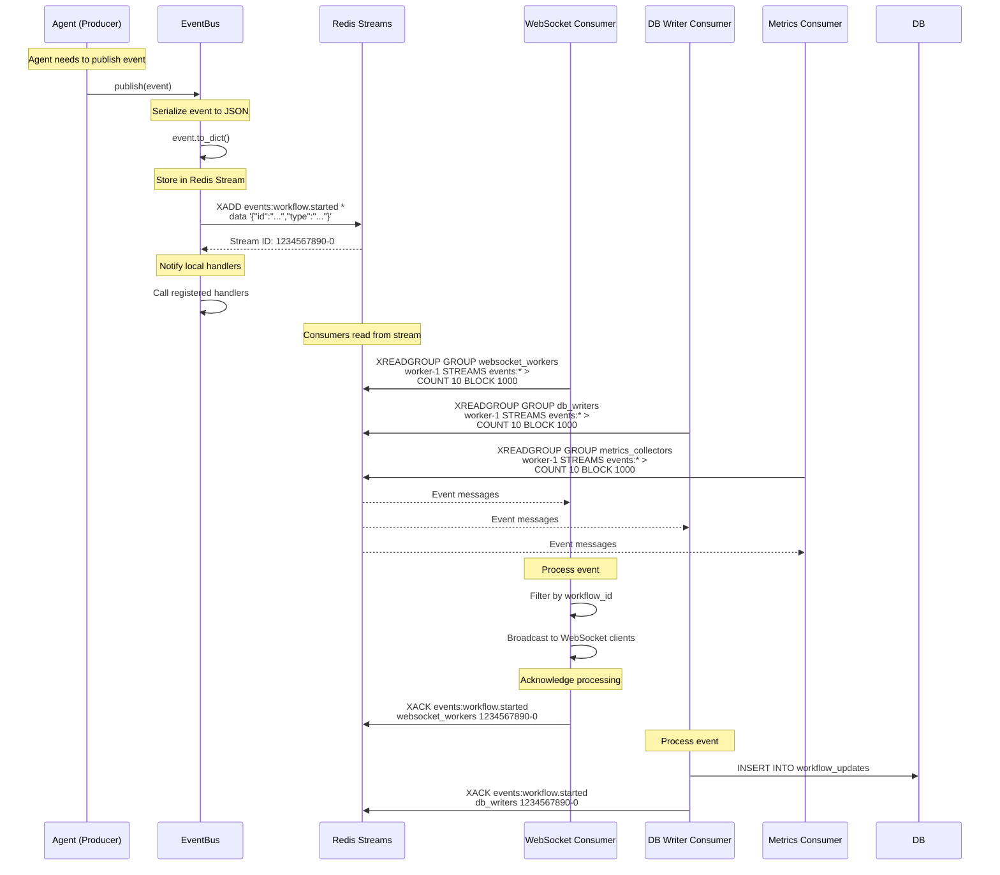
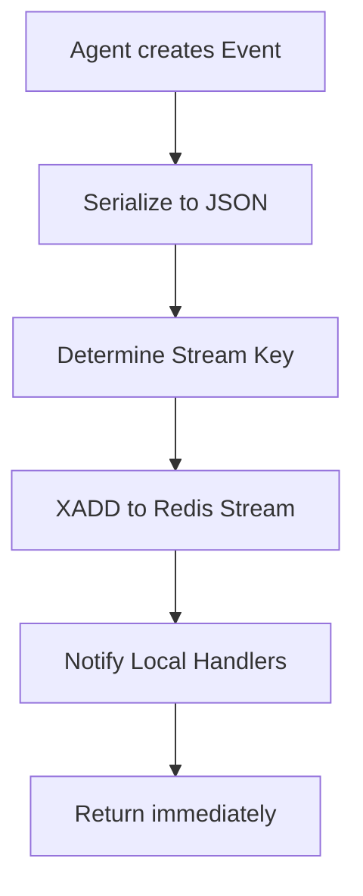
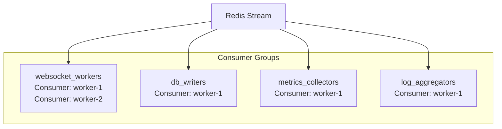
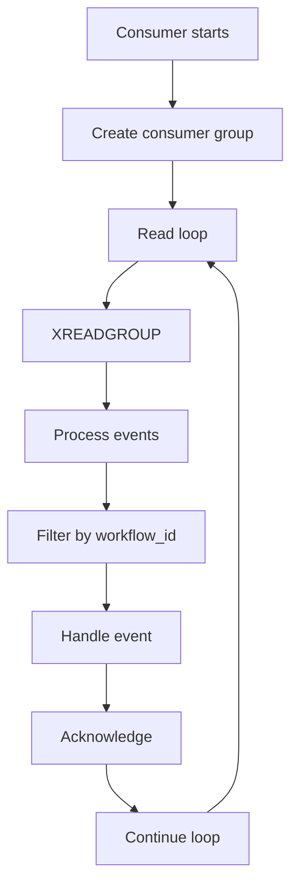

# Under the Hood: How HyperAgent Uses Redis Streams for its Event Bus

## Overview

HyperAgent's Event Bus is implemented using Redis Streams, providing persistent, scalable event-driven communication between agents.

## Diagram



## Event Flow with Redis Streams

### 1. Event Publishing


**Code**:
```python
async def publish(self, event: Event) -> None:
    # Serialize event
    stream_key = f"events:{event.type.value}"
    
    # Store in Redis Stream
    await self.redis.xadd(
        stream_key,
        {"data": json.dumps(event.to_dict())},
        id="*"  # Auto-generate ID
    )
    
    # Notify local handlers
    if event.type in self._handlers:
        for handler in self._handlers[event.type]:
            await handler(event)
```

### 2. Stream Structure
```mermaid
graph TB
    subgraph "Redis Streams"
        S1[events:workflow.created<br/>Stream ID: 123-0<br/>Data: {...}]
        S2[events:workflow.started<br/>Stream ID: 124-0<br/>Data: {...}]
        S3[events:generation.completed<br/>Stream ID: 125-0<br/>Data: {...}]
        S4[events:audit.completed<br/>Stream ID: 126-0<br/>Data: {...}]
    end
```

**Stream Keys**:
- `events:workflow.*` - Workflow lifecycle events
- `events:generation.*` - Generation events
- `events:audit.*` - Audit events
- `events:testing.*` - Testing events
- `events:deployment.*` - Deployment events
- `events:a2a.*` - A2A communication events

### 3. Consumer Groups


**Consumer Group Benefits**:
- **Load Balancing**: Distribute events across consumers
- **Fault Tolerance**: Failed consumers don't block others
- **Message Acknowledgment**: Track processing status
- **Replay Capability**: Reprocess failed messages

### 4. Event Consumption


**Code**:
```python
async def consume_stream(self, event_type: EventType, 
                       consumer_group: str = "default"):
    """Consume events from Redis Stream"""
    stream_key = f"events:{event_type.value}"
    
    # Create consumer group if not exists
    try:
        await self.redis.xgroup_create(
            stream_key, consumer_group, id="0", mkstream=True
        )
    except redis.ResponseError:
        pass  # Group already exists
    
    while True:
        # Read events
        messages = await self.redis.xreadgroup(
            consumer_group,
            "worker-1",
            {stream_key: ">"},  # Read new messages
            count=10,
            block=1000  # Block for 1 second
        )
        
        for stream, events in messages:
            for event_id, event_data in events:
                # Process event
                event_dict = json.loads(event_data[b"data"])
                event = Event(...)  # Reconstruct
                
                # Acknowledge
                await self.redis.xack(
                    stream_key, consumer_group, event_id
                )
                
                yield event
```

## Redis Streams Operations

### XADD - Publish Event
```redis
XADD events:workflow.started * 
  data '{"id":"uuid","type":"workflow.started","workflow_id":"...","timestamp":"...","data":{},"source_agent":"coordinator"}'
```

**Returns**: Stream ID (e.g., `1234567890-0`)

### XREADGROUP - Consume Events
```redis
XREADGROUP GROUP websocket_workers worker-1
  STREAMS events:workflow.* >
  COUNT 10
  BLOCK 1000
```

**Parameters**:
- `GROUP`: Consumer group name
- `worker-1`: Consumer name
- `>`: Read new messages
- `COUNT 10`: Read up to 10 messages
- `BLOCK 1000`: Block for 1 second if no messages

### XACK - Acknowledge Processing
```redis
XACK events:workflow.started 
  websocket_workers 1234567890-0
```

**Purpose**: Mark message as processed

### XPENDING - Check Pending Messages
```redis
XPENDING events:workflow.started websocket_workers
```

**Purpose**: Check for unacknowledged messages

## Event Bus Features

### Local Handlers
```python
# Subscribe to event type
event_bus.subscribe(EventType.GENERATION_COMPLETED, on_generation_complete)

async def on_generation_complete(event: Event):
    print(f"Contract generated: {event.data['contract_code']}")
```

### Stream Consumption
```python
# Consume events from stream
async for event in event_bus.consume_stream(
    EventType.WORKFLOW_STARTED,
    consumer_group="websocket_workers"
):
    # Process event
    await broadcast_to_websocket(event)
```

## Benefits

- **Persistence**: Events stored in Redis (survives restarts)
- **Scalability**: Multiple consumers can process events
- **Reliability**: Consumer groups with acknowledgment
- **Ordering**: Events maintain order within stream
- **Replay**: Can replay events from any point
- **Performance**: Fast in-memory operations
- **Durability**: AOF + RDB persistence options

## Performance

- **Event Propagation**: < 10ms
- **Throughput**: 10,000+ events/second
- **Latency**: p99 < 50ms
- **Durability**: Configurable (AOF, RDB, both)

